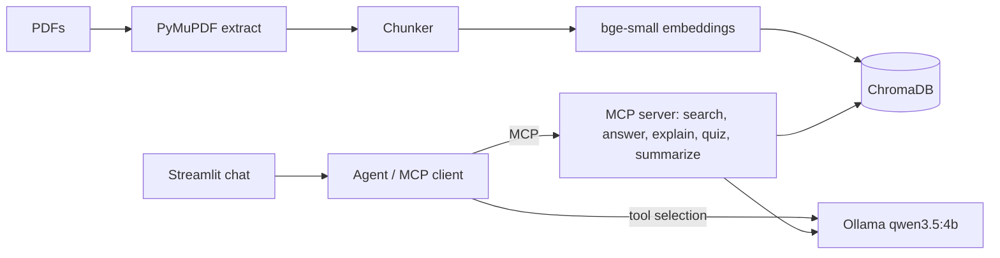

# Architecture

See SPEC.md section 4 for the full design. Keep this diagram in sync with the code.

```mermaid
flowchart LR
    A[PDFs] --> B[PyMuPDF extract] --> C[Chunker] --> D[bge-small embeddings] --> E[(ChromaDB)]
    U[Streamlit chat] --> AG[Agent / MCP client]
    AG -- tool selection --> L[Ollama qwen3.5:4b]
    AG -- MCP --> S[MCP server: search, answer, explain, quiz, summarize]
    S --> E
    S --> L
```
